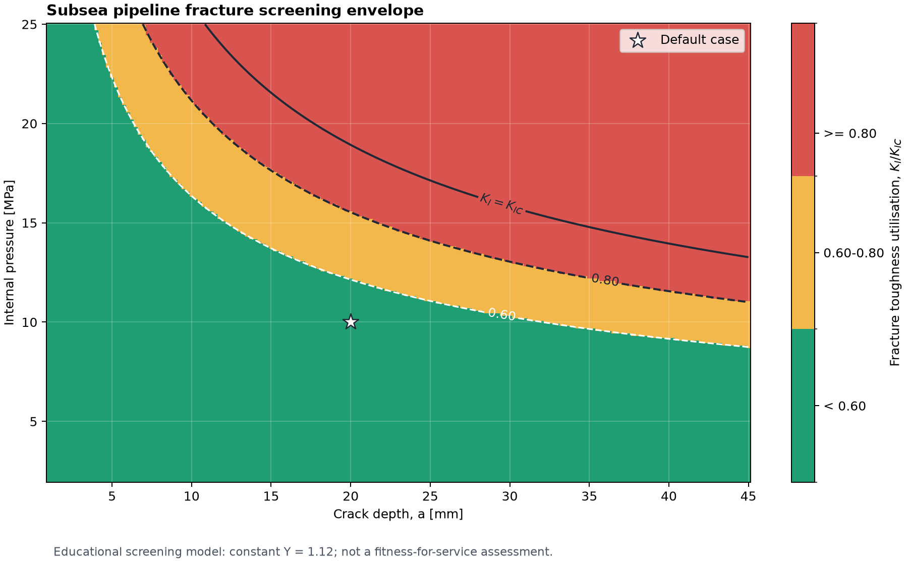

# Subsea Pipeline Fracture Assessment

An educational fracture-mechanics project for a pressurised subsea pipeline
with a longitudinal surface crack. The current repository provides a
reproducible analytical screening workflow in Python. A corrected Abaqus model
will be added as a separate numerical-verification phase.

The work extends an individual project from **TMM4142 - Finite Element Methods
in Structural Analysis at NTNU**. The original assignment combined hand
calculations with an Abaqus exercise. Because the original crack model did not
produce a valid crack-tip solution, its numerical results are not presented as
validation here.



## Engineering question

How do internal pressure, hydrostatic external pressure and assumed crack depth
affect a simplified Mode I fracture-toughness screening calculation?

## Current scope

The Python workflow calculates:

- hydrostatic external pressure and net pressure;
- thin-wall hoop stress at the mean pipe radius;
- simplified Mode I stress intensity, `K_I`;
- fracture-toughness utilisation, `K_I / K_IC`;
- Irwin plane-stress and plane-strain plastic-zone estimates;
- thin-wall, elastic-stress, plane-strain-size and small-scale-yielding checks;
- pressure boundaries for selected utilisation levels; and
- a pressure-versus-crack-depth screening envelope exported to PNG and CSV.

## Default educational case

| Parameter | Value |
| --- | ---: |
| Internal pressure | 10 MPa |
| Water depth | 200 m |
| Seawater density | 1000 kg/m3 |
| Inner radius | 0.50 m |
| Wall thickness | 50 mm |
| Assumed crack depth | 20 mm |
| Yield strength | 450 MPa |
| Supplied fracture toughness | 50 MPa sqrt(m) |
| Simplified geometry factor | 1.12 |

For this input, the model returns:

| Result | Value |
| --- | ---: |
| External pressure | 1.962 MPa |
| Net pressure | 8.038 MPa |
| Hoop stress | 84.399 MPa |
| Simplified `K_I` | 23.694 MPa sqrt(m) |
| `K_I / K_IC` | 0.474 |

The thin-wall, elastic-stress and small-scale-yielding screening checks pass.
The plane-strain size check does **not** pass because the 20 mm crack dimension
is smaller than the calculated minimum dimension of approximately 30.86 mm.
The toughness comparison is therefore retained as an educational screening
calculation, not a validated fitness-for-service conclusion.

## Model basis

The net pressure and thin-wall hoop stress are

```text
p_net = p_internal - rho * g * water_depth
sigma_h = p_net * r_mean / t
```

The first analytical version uses

```text
K_I = Y * sigma_h * sqrt(pi * a)
```

with a constant `Y = 1.12`. This is intentionally simple and is not a validated
geometry solution for a semi-elliptical surface crack in a curved pipe wall.
See [`documentation/analytical-basis.md`](documentation/analytical-basis.md).

## Run locally

Python 3.10 or newer is recommended.

```bash
python3 -m venv .venv
source .venv/bin/activate
python3 -m pip install -r requirements.txt
python3 run_analysis.py
python3 -m unittest discover -s tests -v
```

The analysis writes:

- `results/operating_envelope.png`;
- `results/operating_envelope.csv`; and
- a console summary of the default case and pressure boundaries.

## Repository structure

```text
subsea-pipeline-fracture-assessment/
├── README.md
├── run_analysis.py
├── requirements.txt
├── src/
│   ├── fracture.py
│   ├── envelope.py
│   └── plotting.py
├── tests/
│   └── test_fracture.py
├── results/
│   ├── operating_envelope.png
│   └── operating_envelope.csv
├── documentation/
│   ├── analytical-basis.md
│   ├── limitations.md
│   ├── verification.md
│   └── abaqus-validation-plan.md
└── abaqus/
    └── README.md
```

## Abaqus phase

The finite-element phase remains in progress. The corrected model must include
a valid surface-crack representation, separated crack faces, a defined crack
front, appropriate local meshing, multiple contour-integral evaluations and a
mesh-convergence study. No numerical `J` or `K_I` result will be published as
validation until those checks have been completed.

The planned evidence is described in
[`documentation/abaqus-validation-plan.md`](documentation/abaqus-validation-plan.md).

## Important limitations

This repository is an educational engineering study. It is not a design check,
a safe operating envelope or a fitness-for-service assessment. It does not
implement BS 7910, API 579-1/ASME FFS-1 or a DNV assessment procedure. Residual
stress, fatigue crack growth, corrosion, weld mismatch, plastic collapse,
combined loading and material uncertainty are outside the current scope.

